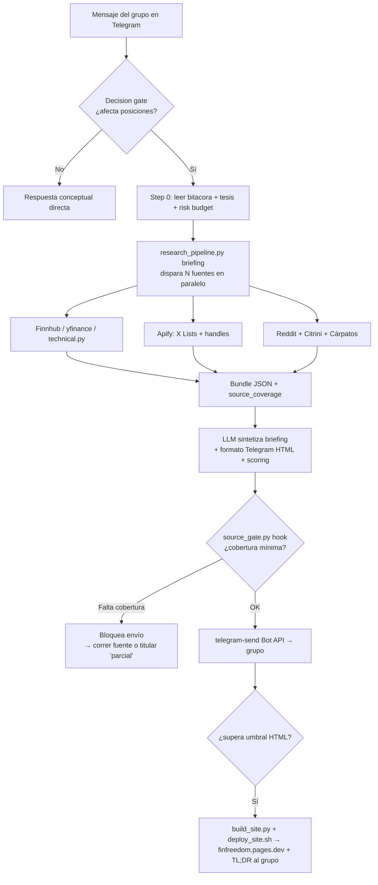

# Análisis del proyecto `financial-freedom`

> Documento generado a partir de la lectura de los `.md` del repo (`AGENTS.md`, `README.md`,
> `DEVELOPMENT.md`, `tools/docs/*`, `agent-memory/*`, `analisis/*`) y de los scripts de
> `tools/scripts/` y `tools/publish/`. Es una foto explicativa del sistema, no una regla
> operativa nueva. La fuente canónica de reglas sigue siendo `AGENTS.md`.
>
> **Actualizado 2026-06-03**: el repo incorporó una **capa web del grupo**
> (`finfreedom.pages.dev`) con datos estructurados, Cloudflare Workers/D1 y edición desde el
> navegador (ver §7), `AGENTS.md` pasó a **20 reglas duras + #12bis** (se añadieron #19 y #20), y
> aparecieron scripts nuevos. Las secciones reflejan ese estado.

---

## 1. Qué es este proyecto

`financial-freedom` **no es una app**: es el "cerebro" y el sistema operativo de un **bot de
análisis financiero asistido por IA** que sirve a un grupo privado de Telegram ("Financial
Freedom 2030+", 4 traders que operan desde la UE en IBKR).

Combina tres cosas en un mismo repo:

1. **Reglas y memoria del agente** (Markdown): qué debe hacer el bot, cómo, con qué fuentes y
   con qué formato. Es lo que cargan los modelos LLM al arrancar.
2. **Herramientas deterministas** (Python en `tools/scripts/`): scripts que traen datos de
   mercado en vivo, calculan valoraciones, vigilan alertas y publican informes. **No usan LLM**.
3. **Conocimiento de inversión** (`analisis/`, `bitacora/`, `referencias/`): tesis de mercado,
   diario operativo del grupo y fuentes citadas.

La filosofía central, repetida en todos los docs:

> El **LLM sintetiza y recomienda**; los **scripts recopilan datos**. El script de orquestación
> (`research_pipeline.py`) "NO toma decisiones operativas, solo recopila datos. La síntesis y
> recomendación las hace el modelo."

El objetivo es responder al grupo de Telegram con briefings de mercado, snapshots de tickers,
gestión de posiciones y análisis técnico, siempre **con datos en vivo** y **anclados a las
posiciones reales del grupo**, no como resumen genérico de noticias.

Desde 2026-06 hay un **segundo canal de salida** además de Telegram: la **web del grupo**
`finfreedom.pages.dev` (Cloudflare Pages tras Access), que saca al grupo de la "locura de
Telegram" con índice, dashboard, posiciones, tesis, temas, threads, watchlists y guía, con
precio en vivo y edición desde el navegador (ver §7).

---

## 2. Dónde corre todo (hardware y runtime)

Todo el sistema corre en **una única máquina física casera**, no en cloud: un **mini PC llamado
`lsmachenike`**. Es el "hierro" donde viven los agentes, los scripts, la memoria y los secrets.

**Hardware del mini PC `lsmachenike`:**

| Componente | Spec |
|---|---|
| Equipo | Mini PC **Intel N150** |
| CPU | Intel **N150** (4 núcleos) |
| RAM | **16 GB** |
| Almacenamiento | **SSD 512 GB** |
| SO | Linux |

> El equipo es un mini PC Intel N150 (confirmado por el maintainer). La ficha técnica detallada no
> está en este repo: vive en `workspace-llp/It-home/lsmachenike/` (referenciado desde el roadmap
> Hermes pero externo a `financial-freedom`).

**Cómo se reparte la máquina (aislamiento por usuario Linux):**

- Usuario dedicado **`hermes-financial`** = runtime financiero. `adminllp` no se usa como runtime
  salvo mantenimiento.
- Repo canónico en `/home/hermes-financial/financial-freedom`, grupo `agents-financial` con RW
  para `adminllp`, `hermes-financial` y `hermes-personal`.
- Python venv aislado: `/home/hermes-financial/.venvs/financial-freedom` (no se usa el `python3`
  del sistema).
- Secrets fuera del repo: `/home/hermes-financial/.config/financial-freedom/secrets.env`
  (chmod 600) y `~/.claude/skills/*/.env`.

**Runtime actual vs objetivo (sobre el mismo mini PC):**

- **Hoy**: Claude Code se arranca a mano en una sesión `tmux` (`claude-financial`) bajo
  `hermes-financial`, conectado a Telegram por el plugin Channels. El scheduling
  (`market_watch.py`, resúmenes) se lanza manualmente.
- **Objetivo**: daemon **Hermes** residente 24/7 en la misma máquina, con scheduler propio (sin
  cron/systemd manual por ahora) y la memoria compartida vía symlink
  `~/.hermes/memories -> agent-memory/`.

**Implicaciones de un único mini PC modesto (N150 / 16 GB):**

- Se prioriza coste y ligereza: MCPs residentes mínimos (`jina`, `apify`, `fmp`, `context7`); el
  resto de skills se cargan on-demand.
- Las tareas pesadas (pre-proceso de ~500k tokens del chat histórico) se delegan a **Codex** con
  suscripción, no se corren con Claude Opus en local por coste y memoria.
- Riesgos documentados en el roadmap a tener en cuenta por el hardware: locale Linux no UTF-8 que
  rompe emojis, caída de servicios (p. ej. Postgres de Hindsight) y rate limits de las APIs.

---

## 3. Los "agentes" que usa

El proyecto está diseñado como un sistema **multi-agente** donde varios modelos/runtimes
comparten el mismo repo como fuente de verdad. El estándar de carga es: `CLAUDE.md` →
`@AGENTS.md`; Codex lee `AGENTS.md` directamente; cualquier otro agente sigue el mismo patrón.

| Agente / runtime | Rol en el sistema | Estado |
|---|---|---|
| **Claude Code** | Runtime interactivo principal hoy. Arranca en `tmux` bajo el usuario Linux `hermes-financial`, conectado a Telegram vía el plugin Channels. Lee `AGENTS.md` vía `CLAUDE.md`. Hace la síntesis del briefing y redacta el HTML/Telegram. | Activo (runtime transitorio) |
| **Hermes** | **Runtime objetivo final**: agente residente 24/7 con scheduler propio, memoria persistente y gateway de Telegram. Va a reemplazar a Claude Code como operador permanente. Comparte memoria vía symlink `~/.hermes/memories -> agent-memory/`. | En migración (roadmap por fases) |
| **Codex** | Agente "de apoyo" con suscripción aparte. Se usa para tareas caras o de validación: generar el `RECAP_MERCADOS_2026_YTD.md`, validar consolidaciones de `AGENTS.md`, y el pre-procesamiento del chat histórico (~500k tokens) que sería demasiado caro con Claude Opus. | Activo on-demand |
| **Gemini** (`gemini-consult-api`) | Consultas conceptuales/lógicas puntuales. **Restringido por REGLA DURA #14**: solo tesis lógicas/conceptuales, nunca datos vivos, precios o eventos (su training data está desactualizado). Tiene flag `--grounding` para búsqueda web. | Activo, uso limitado |

Además, hay **sub-runtimes y skills** que actúan como herramientas del agente principal:

- **MCPs residentes mínimos**: `jina` (lectura/búsqueda web ligera), `apify` (scraping social a
  escala), `fmp` (fundamentales, hoy roto en free tier), `context7` (docs de librerías).
- **Skills CLI on-demand**: `playwright-cli` (SPAs públicas), `markitdown`, `cdp-browser`
  (sesión propia), `telegram-send` (envío rico Bot API), `r-files` (publicación HTML),
  `telegram-design` (formato).
- **Hook determinista** (`source_gate.py`): no es un agente, pero es una "defensa automática"
  que intercepta los envíos del agente antes de que salgan por Telegram (ver §6).

---

## 4. De dónde obtiene la información

Regla maestra (REGLA DURA #4 + memoria `feedback-noticias-valoraciones-actualizado`): para todo
lo sensible al tiempo (precios, múltiplos, news, sentiment) **se consulta fuente en vivo**,
nunca el conocimiento del modelo. El catálogo completo vive en `tools/docs/data-sources.md` y el
árbol de decisión en `tools/docs/decision-tree-fuentes.md`.

### Fuentes de datos de mercado

| Fuente | Qué da | Cómo se accede | Coste |
|---|---|---|---|
| **Finnhub API** | Precio, métricas (P/E, 52w, beta), recomendaciones, profile, news, earnings | `finnhub_query.py` | Free 60 req/min |
| **yfinance (Yahoo)** | Precio, pre/post-market, fundamentales, price targets, indicadores | `valuation.py`, `technical.py` | Gratis |
| **stockanalysis.com** | Múltiplos forward (fwd PE, EV/EBITDA), price targets, growth | WebFetch (HTML estático) | Gratis |
| **AlphaVantage** | OHLCV histórico, indicadores técnicos | MCP | Free 25/día (fallback) |
| **FMP** | Fundamentales / DCF | `fmp_query.py` | **Roto** desde 31-ago-2025 (free tier cerrado) |
| **FRED** | Macro: yields, M2, CPI, fed funds | *Pendiente (TODO, sin script)* | Gratis |
| **SEC EDGAR** | 10-K/Q, 8-K, Form 4 insider, 13F | *Parcial (TODO `track_13f.py`)* | Gratis |

### Fuentes de sentiment y narrativa

| Fuente | Qué da | Cómo se accede |
|---|---|---|
| **X / Twitter Lists** | Sentiment institucional/referentes. Lista "Stonks" (id `1988527303635411209`, 36 miembros) | Apify actor → `x_lists_fetch.py` |
| **X handles concretos** | Tweets de `@citrini`, `@zephyr_z9`, `@jukan05` | Apify pool → `x_user_fetch.py` |
| **Reddit** | Sentiment retail: r/wallstreetbets (pulse emocional), r/stocks (value/calmado), r/investing | JSON público → `reddit_retail.py`; `reddit-mcp-buddy` en sesión interactiva |
| **Citrini Research (Substack)** | Tesis semis/AI infra/supply chain | Jina Reader/Search → `citrini_digest.py` |
| **YouTube (Cárpatos)** | Vídeo diario de mercado (9/13/18h ESP) | `youtube_transcript.py latest carpatos` |

### Fuentes locales (estado y conocimiento del propio grupo)

- `bitacora/`: posiciones reales, decisiones, sesgos personales, perfiles de traders, risk
  budget. **Privado, ignorado por Git.** Es el "Step 0" obligatorio.
- `analisis/`: tesis de inversión, deep dives sectoriales, contexto macro fechado.
- `tools/data/watchlists/*.json`: watchlists del usuario (ai-stack, energéticas, ~140 tickers).
- `RECAP_MERCADOS_2026_YTD.md` + anexo Claude: foto macro mensual para cerrar el gap entre el
  knowledge cutoff del modelo (ene-2026) y el estado real.

### Capas de scraping (no saltar capas)

`WebFetch / lectura directa` → `Jina Reader` → `Apify actor específico` → `playwright-cli`
(SPAs) → `cdp-browser` (sesión propia) → `Camoufox` (anti-bot duro). Para plataformas con
login/API propia (X, Reddit, YouTube) se va directo al actor Apify especializado.

---

## 5. Mapa de los scripts (`tools/scripts/`)

Son **herramientas deterministas sin LLM**. El agente las invoca por `subprocess` y luego
sintetiza el output. Las clave:

| Script | Función |
|---|---|
| **`research_pipeline.py`** | **Orquestador principal.** Detecta el tipo de pregunta y dispara N herramientas en paralelo, devuelve un bundle JSON con `source_coverage`. Modos: `briefing`, `ticker`, `position`, `technical`. |
| **`source_gate.py`** | Gate/hook determinista pre-envío: bloquea "briefings completos" sin cobertura mínima de fuentes. |
| `quick_market_snapshot.py` | Pulso rápido de mercado (incluye X List Stonks por defecto). |
| `market_watch.py` | Vigilancia proactiva de alertas (lee `watch-rules.yaml`). Modos `run`, `summary`, `status`. |
| `valuation.py` | Valoración completa de un ticker (precio + fundamentales + targets + técnico + DCF Claude + veredicto 5 ejes). |
| `dcf_manual.py` | DCF propio reproducible (REGLA DURA #3: fair value calculado por Claude). |
| `finnhub_query.py` | Quote, snapshot, news, earnings vía Finnhub. |
| `technical.py` | Indicadores (RSI/MACD/BB/ADX), `sectors` (11 SPDR + rotación), `world` (bolsa mundial), `chart` (PNG Finviz). |
| `x_lists_fetch.py` / `x_user_fetch.py` / `x_search_fetch.py` | Tweets de listas / handles / **búsqueda por topic** vía Apify. |
| `reddit_retail.py` | Sentiment retail vía JSON público de Reddit. |
| `citrini_digest.py` | Posts de Citrini vía Jina. |
| `youtube_transcript.py` | Transcript de vídeos (Cárpatos). |
| `generate_dashboard.py` / `generate_report.py` / `cockpit_render.py` / `regime_dashboard.py` | Generación de HTML/cockpit y dashboard de régimen de mercado. |
| `trade_log.py` | Registro de trades. |
| `telegram_md_lint.py` | Linter de MarkdownV2 pre-envío (REGLA DURA #8). |
| `update_all_watchlists.py` | Refresca precios de las watchlists locales (legacy `tools/data/watchlists/`, NO la web). |
| `finfreedom_notes_sync.py` | Lista/completa notas y **eventos** pendientes de la web (D1): el agente los aplica al repo (REGLA #20). |
| `symbols.py` | Resolución/normalización de tickers y universos. |
| `env_utils.py` | Carga `secrets.env` del repo (keys fuera del control de versiones). |

> La **publicación de la web** ya no la hace `publish.py` (esa skill `r-files` queda para HTML
> puntual y **bloquea `--target reports`** por REGLA DURA #1). El sitio del grupo lo genera
> `tools/publish/build_site.py` y se despliega con `bash tools/publish/deploy_site.sh` (ver §7).

---

## 6. Cómo se orquestan los agentes

La orquestación tiene **dos niveles**: un árbol de decisión cognitivo (qué hace el modelo) y un
orquestador determinista de herramientas (qué scripts se disparan). Encima, un gate automático.

### 6.1. Decision gate (lo decide el modelo)

Definido en `agent-memory/reference_research_pipeline.md`. Antes de responder cualquier mensaje:

```
¿La pregunta puede afectar posiciones reales?
   ├─ NO  → modo conceptual: respuesta directa sin pipeline (definiciones, "qué es X")
   └─ SÍ  → modo inversión real:
            Step 0 OBLIGATORIO (REGLA DURA #6):
              - leer bitacora/2026-MM-posiciones-y-decisiones.md
              - leer analisis/tesis-activas.md (T1-T5)
              - leer bitacora/risk-budget.md
            → aplicar pipeline determinista + sanity checks + formato + scoring
```

El briefing **no es un resumen de noticias**: es síntesis accionable contra las posiciones
actuales del grupo (SNDK short, MU short, etc.).

### 6.2. Pipeline determinista (lo ejecuta `research_pipeline.py`)

Para cada **tipo de pregunta**, siempre el **mismo set de herramientas en paralelo** (60-120s
aceptable, no se optimiza por latencia). Esto reemplaza el patrón reactivo "decidir herramientas
turn-by-turn" por uno reproducible:

- **Tipo 1, Market briefing** (`briefing`): Step 0 + Cárpatos + sectorial US + bolsa mundial +
  cross-asset (NQ, ES, VIX, oro, petróleo, TLT, DXY, BTC) + news SPY + X List Stonks + Reddit
  retail + Citrini/zephyr/jukan + señales técnicas + valoración de tickers mencionados.
- **Tipo 2, Single ticker** (`ticker`): `valuation.py <T>` + news 7d + chart opcional.
- **Tipo 3, Position management** (`position`): leer posición exacta + doble fuente de precio +
  separar táctica de tesis + escenarios (no orden única).
- **Tipo 4, Technical** (`technical`): `technical.py signals` + niveles concretos.

El bundle JSON resultante incluye un campo **`source_coverage`** con `consulted`, `omitted`,
`errors`, timestamps y `ok_for_briefing_completo`.

### 6.3. Gate automático pre-envío (defensa en código)

Modelo "hook vs script" de `DEVELOPMENT.md`: un script solo ayuda si el agente se acuerda de
llamarlo; para fallos repetidos hace falta una defensa automática. Por eso:

1. `source_gate.py` es el motor determinista, lee `tools/data/source-policy.yaml`.
2. Un **hook `PreToolUse`** de Claude Code (en `~hermes-financial/.claude/settings.json`,
   matcher `Bash`) intercepta las llamadas a `telegram-send`.
3. Si el payload parece "briefing completo" y no declara la cobertura mínima de fuentes
   (Step 0, Cárpatos, sectorial, cross-asset, news, X Stonks, Reddit, ≥1 especialista en 24h),
   devuelve `permissionDecision=deny` y **bloquea el envío**.
4. El agente puede explicar omisiones, pero no puede llamar "completo" a algo incompleto.
5. Escape hatch explícito: titular `briefing parcial` o incluir `#source-gate-override`.

Hermes deberá replicar ese mismo gate en su gateway, porque el objetivo final es no depender de
los hooks de Claude Code.

### 6.4. Orquestación proactiva (sin que nadie pregunte)

`market_watch.py` + `watch-rules.yaml` definen alertas que se disparan solas: rotación
sectorial, movimientos extremos (>2.5% sectores, >3.5% posiciones del repo), VIX spike/umbral,
shocks de petróleo, subida de yields, nuevo vídeo de Cárpatos. Más resúmenes programados
(matinal 08:00 ESP, cierre 22:15 ESP) y anti-spam (`max_alerts_per_day: 12`). Hoy se ejecuta a
mano; en el roadmap lo programa el scheduler de Hermes.

### 6.5. Diagrama de flujo (petición de briefing end-to-end)



---

## 7. La web del grupo (`finfreedom.pages.dev`)

Capa añadida en 2026-06 (REGLA DURA #20, detalle en `tools/docs/finfreedom-web.md`). Es un sitio
**propio** en Cloudflare Pages, **protegido por Cloudflare Access** (login Google del grupo), que
da al grupo una vista persistente fuera del chat. **No** sustituye al pipeline ni a las reglas:
es una proyección de datos del repo, **saneada de PII** (REGLA #7).

### 7.1 Páginas y fuentes (single source of truth)

| Página | Fuente de datos | Qué muestra |
|---|---|---|
| Índice + Dashboard | snapshot yfinance en build + Worker live | mercado, watchlists (vista rápida), tarjetas de cada página |
| Posiciones | `tools/data/finfreedom/participants.json` | posiciones por miembro, separa **largo plazo** (`kind=posicion`) de **trades** (`kind=trade`) con entry/target/stop → P/L y R:R en vivo |
| Tesis | `analisis/tesis-activas.md` | tesis con convicción + notas (D1) |
| Temas | `tools/data/finfreedom/temas.json` (proyección de `next-pelotazos-vigilancia.md`) | next-pelotazos con score 1-5, pure plays con precio vivo + bloque rotación |
| Threads | `tools/data/finfreedom/threads.json` | hilos de análisis en curso con **log fechado** (evento/pregunta/rotación), sin requerir posición |
| Watchlists | `tools/data/finfreedom/watchlists.json` | listas de seguimiento con precio vivo, editables desde web |
| Guía | `tools/docs/manual-grupo.md` (render) | manual del grupo |
| Reports | `reports/*.html` (gitignored) | briefings publicados |
| Desarrollo | `DEVELOPMENT.md` + detalles GitHub | estado de desarrollo |

### 7.2 Infraestructura Cloudflare (edge, no solo el mini PC)

A diferencia del resto del sistema (que vive en el mini PC), la web se apoya en **edge de
Cloudflare**:

- **Pages** `finfreedom` (`finfreedom.pages.dev`), nunca el proyecto `r-files` del admin (REGLA #1).
- **Worker de precio** `finfreedom-quotes` (Yahoo + Finnhub + caché KV): precio y P/L en vivo en cliente.
- **Worker de edición** `finfreedom-api` + **D1** (`finfreedom-db`, SQLite gestionada): tablas
  `notas` y `eventos`. Gate por secreto `FF_NOTES_SECRET` (embebido solo en el build gitignored,
  nunca en Git), CORS limitado.
- **Cloudflare Access**: solo emails del grupo; protege también los aliases `*.finfreedom.pages.dev`.

### 7.3 Flujo de edición (web propone, agente concilia) = HITL de facto

Hay dos dueños del dato, y eso define un patrón Human-in-the-Loop natural:

- **Notas** (dueño: D1): añadir/editar/borrar se aplica al instante en la web; el agente solo
  **completa** las notas `nueva` (`finfreedom_notes_sync.py --complete`).
- **Posiciones y watchlists** (dueño: Git): la web **no toca Git**; alta/edición/baja/cierre
  llegan como **eventos tipados** (`posicion_*`, `watchlist_*`) a la D1. El agente los lee
  (`finfreedom_notes_sync.py --events`), los **aplica** a `participants.json` / `watchlists.json`
  (con fecha, conciliando), hace `deploy_site.sh` y cierra el evento. `posicion_close` calcula
  **P/L realizado** vs `entry` y, para trades, loguea un `close` en `bitacora/trades.jsonl`.

### 7.4 Motor de build (`tools/publish/`)

`build_site.py` genera el sitio (Pico.css v2 + `finfreedom.css`), **sanea PII** antes de escribir
y deja el output en `tools/publish/build/` (gitignored: datos del grupo). Hay un **patrón
documentado** para añadir páginas de datos (JSON → `load_x` → `render_x` → nav → tarjeta → wiring,
con celdas `data-ticker` para precio en vivo); Threads es la plantilla mínima. Deploy en un
comando: `bash tools/publish/deploy_site.sh`.

---

## 8. Estructura del repo y jerarquía de documentos

`AGENTS.md` (REGLA DURA #13, detallada en `tools/docs/jerarquia-documentos.md`) define dónde va
cada cosa. El principio: **single source of truth**, no duplicar reglas.

```
financial-freedom/
├── AGENTS.md          # Fuente canónica de REGLAS DURAS operativas (#1–#20 + #12bis)
├── CLAUDE.md          # Solo lleva @AGENTS.md (carga automática Claude Code)
├── README.md          # Índice general del repo
├── DEVELOPMENT.md     # Mapa de desarrollo del bot (NO runtime: arquitectura, hooks, YAML)
├── TASKS.md           # Backlog técnico (features, no bugs)
├── bugs-to-fix.md     # Bugs reproducibles (REGLA DURA #18)
├── CONTRIBUTING.md    # Flujo Git / PRs / privacidad
├── RECAP_MERCADOS_2026_YTD.md (+ ANEXO_CLAUDE)  # Foto macro mensual
│
├── analisis/          # Tesis de inversión, deep dives, macro fechado (opinión que envejece)
├── bitacora/          # Estado vivo: posiciones, sesgos, traders, risk budget, trades.jsonl (PRIVADO, no Git)
├── referencias/       # URLs, papers, citas
├── agent-memory/      # Memoria del agente versionada y compartida Claude/Hermes
├── reports/           # Briefings HTML publicados (gitignored)
└── tools/
    ├── scripts/       # Herramientas deterministas Python
    ├── docs/          # Manuales técnicos, fuentes, taxonomías, formato Telegram
    ├── publish/       # Motor de la web del grupo (build_site.py, Workers, deploy_site.sh)
    └── data/
        ├── source-policy.yaml, watch-rules.yaml   # políticas del pipeline y alertas
        ├── watchlists/        # watchlists legacy (snapshots Finnhub, NO la web)
        └── finfreedom/        # datos estructurados de la web: participants/watchlists/temas/threads/notas.json
```

> El puntero `agents.md` (minúscula) se **eliminó** del repo en este checkout (colisión de
> mayúsculas en macOS, ver §12.1); `CLAUDE.md` sigue cargando `@AGENTS.md`.

Reglas de mantenimiento clave:
- Ficheros **fechados** (`YYYY-MM-`) para snapshots; ficheros **sin fecha** para tesis/log
  acumulativo.
- **No reescribir histórico**: si un análisis envejeció mal, se deja y se crea uno nuevo.
- **Regla operativa permanente** → `AGENTS.md`; **procedimiento técnico** → `tools/docs/`;
  **tesis** → `analisis/`; **estado del portfolio** → `bitacora/`; **lección del agente** →
  `agent-memory/`.

---

## 9. Memoria del agente (`agent-memory/`)

Es la memoria persistente versionada, compartida entre Claude y Hermes (vía symlink). Las
memorias externas de Claude (`~/.claude/projects/.../memory/`) están **desactivadas** para evitar
divergencia. Ficheros relevantes (índice en `MEMORY.md`):

- `reference_research_pipeline.md`: el playbook de orquestación (decision gate + pipelines).
- `reference_decision_tree_fuentes.md`: qué fuente atacar según el tipo de pregunta.
- `feedback_noticias_valoraciones_actualizado.md`: regla "siempre datos en vivo" + sanity checks.
- `reference_carpatos_ritual.md`: cuándo leer el último vídeo de Cárpatos.
- `reference_recap_mercados_2026.md`: pointer al RECAP para cerrar el gap de knowledge cutoff.
- `reference_instrument_preferences.md`: índices/futuros cash antes que ETFs US.
- `reference_fmp_free_tier_broken.md`: FMP roto desde 31-ago-2025.
- `USER.md`, `telegram_group_inversiones.md`: **privados, ignorados por Git** (user_ids, perfil).

---

## 10. Reglas duras (resumen de `AGENTS.md`)

`AGENTS.md` contiene 20 reglas duras numeradas (#1 a #20) más una intercalada (#12bis), cada una
con trigger, prohibición, mínimo aceptable y puntero. Listado completo:

| # | Regla | Esencia |
|---|---|---|
| 1 | Publicación r-files | Siempre `--target finfreedom`, nunca `reports` (expone índice privado del admin). Defensa en `publish.py`. |
| 2 | Instrumentos | Índices/commodities en unidad nativa (`^GSPC`, `NQ=F`, `GC=F`), nunca vía ETF US. Excepción: si el usuario cita un ETF concreto. |
| 3 | Fair value | Mostrar siempre DCF calculado por Claude, separado de targets de analistas y "valor justo" de webs. |
| 4 | Datos en vivo | Precios/news/sentiment: siempre fuente viva, nunca conocimiento del modelo. |
| 5 | Sanity checks | Doble fuente de precio, discrepancia con usuario, timestamp pre/post-market, usar `info['preMarketPrice']`. |
| 6 | Step 0 | Leer posiciones + tesis + risk budget antes de cualquier respuesta operativa. |
| 7 | Privacidad | Nunca nombres reales, sesgos o posiciones atribuidas en publicaciones. |
| 8 | Formato Telegram | HTML Bot API o MarkdownV2 validado con `telegram_md_lint.py`; lectura previa de skills de formato. |
| 9 | Panel sectorial tech | Romper tech en subsectores (3-4 mín.), compacto (3-5 tickers), nunca "tech rojo/verde". |
| 10 | Preferencia del grupo en correcciones tech | En pullbacks tech, NO proponer rotación a value/defensivos como destino primario del cash. |
| 11 | X Lists públicas | Leer listas públicas de X vía Apify SIN login; no escalar a navegador autenticado salvo contenido privado. |
| 12 | Objetivo estratégico next-pelotazos | Vigilancia continua del próximo sector FOMO; evaluar temas emergentes contra 5 criterios en el living doc. |
| 12bis | Routing por canal | Responder siempre en el mismo canal de entrada; solo cambiar por orden explícita. |
| 13 | Jerarquía de documentos | Dónde va cada cosa (single source of truth). |
| 14 | Gemini | Solo conceptual/lógico, nunca datos vivos. |
| 15 | Earnings | Distinguir siempre hora del release escrito vs hora del earnings call cuando hay operativa pegada. |
| 16 | Patrones accionables | Reglas como "cuando X, haz Y / no hagas Z", no casos puntuales (anti-bloat). |
| 17 | Normas transversales | Responder en español, fechas ISO `YYYY-MM-DD`, **prohibido el guion largo `—` (U+2014)**, router de scraping/MCPs, validar claims con fuente oficial. |
| 18 | Bugs | Van a `bugs-to-fix.md` con fecha/ruta/severidad/estado. |
| 19 | Identidad del ticker | Antes de recomendar un ticker poco obvio/extranjero, verificar `longName` + `industry` y que cotiza, no solo el precio. Nada de ETFs US a retail UE (PRIIPs) ni A-shares sin Stock Connect. |
| 20 | Web del grupo (finfreedom) | Build/deploy con `tools/publish/`, aplicar eventos `posicion_*`/`watchlist_*` de la D1, mantener `temas.json`/`threads.json` en paralelo a los `.md`, completar notas, **sin PII**. |

---

## 11. Estado actual y roadmap (migración a Hermes)

Según `tools/docs/hermes-integration-roadmap.md`, el sistema está completo como "asistente
invocado" (Claude Code) y migra por fases a Hermes residente:

- **Fase 0**: Hermes base montado *(prerrequisito, sesión aparte)*.
- **Fase 1**: Bring-up instancia financiera aislada (usuario `hermes-financial`, venv, secrets):
  **completada** salvo pruebas residuales (`generate_dashboard.py` en Linux, Jina/FMP en vivo).
- **Fase 2**: Scheduler de `market_watch.py` (Hermes, no cron manual): **deferida**.
- **Fase 3**: Bot Telegram con comandos slash (`/snapshot`, `/signals`, `/sectors`, `/carpatos`,
  `/tesis`...): **pendiente** (cada comando = `subprocess` a un script existente).
- **Fase 4**: Topics + roles por canal (Mercado del día, Técnico, Alertas one-way...): pendiente.
- **Fase 5**: Memoria con **Hindsight** (Postgres + pgvector): World / Experiences / Mental
  Models. Pendiente.
- **Fase 6**: Dashboard estático en CF Pages refrescado por hora: pendiente.

El chat histórico (~500k tokens) se pre-procesará con **Codex** (no Claude Opus, por coste) para
extraer patrones de traders a `bitacora/traders/`, una vez Hindsight esté operativo.

---

## 12. Notas e inconsistencias detectadas

1. **`AGENTS.md` se truncó por una colisión de capitalización en Git (RESUELTO).** El repo tenía
   rastreados **dos ficheros** que solo difieren en mayúsculas: `AGENTS.md` (las REGLAS DURAS
   completas) y `agents.md` (puntero de 3 líneas). En Linux (case-sensitive) coexisten por
   diseño, pero en macOS (case-insensitive, `core.ignorecase=true`) colisionan en un único fichero
   físico; en un checkout "ganó" el puntero corto y truncó las reglas a 3 líneas. **Arreglo
   aplicado**: restaurado `AGENTS.md` desde `HEAD` (337 líneas) y eliminado el duplicado
   `agents.md` del repo (`git rm --cached agents.md`) para evitar que vuelva a ocurrir. `CLAUDE.md`
   sigue actuando como puntero `@AGENTS.md`.

2. **Rutas Linux vs entorno actual.** Todos los docs asumen runtime en Linux bajo
   `/home/hermes-financial/financial-freedom` con el usuario `hermes-financial`. Este checkout
   está en macOS (`/Users/alexmarin/Code/financial-freedom`), así que rutas absolutas, venv y
   symlinks de memoria de los docs no aplican tal cual aquí.

3. **Fuentes pendientes (TODO).** FRED (macro) y SEC EDGAR (insiders/13F) aún no tienen script.
   FMP está roto en free tier desde 31-ago-2025; sus wrappers (`fmp_query.py`) están inservibles
   hasta plan de pago.
